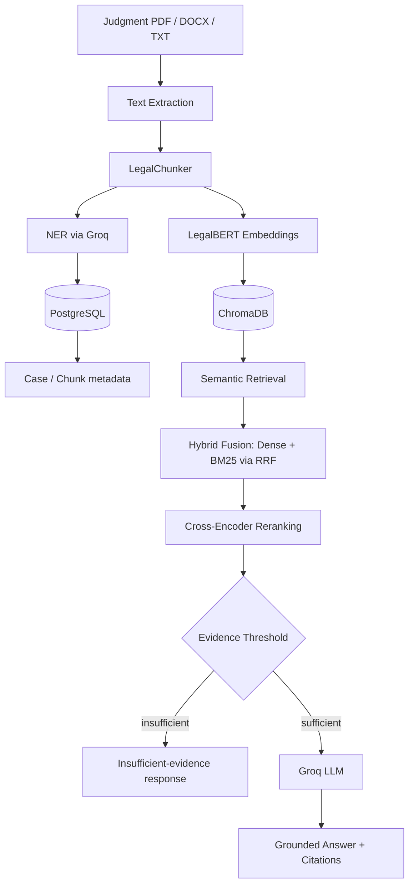

# ChronoLegal

ChronoLegal is a legal research application that builds a searchable legal
knowledge base from uploaded judgment documents and uses
Retrieval-Augmented Generation (RAG) to answer questions about them —
grounded in retrieved evidence, with citations back to the actual source
text.

> College research/major project. Not a substitute for professional legal
> advice, and not intended for production legal use.

---

## Table of Contents

- [Project Objective](#project-objective)
- [Key Features](#key-features)
- [Architecture](#architecture)
- [Technology Stack](#technology-stack)
- [How the RAG Pipeline Works](#how-the-rag-pipeline-works)
- [Why LegalBERT](#why-legalbert)
- [Why ChromaDB + PostgreSQL](#why-chromadb--postgresql)
- [Evidence Safety (Anti-Hallucination Gate)](#evidence-safety-anti-hallucination-gate)
- [Citations](#citations)
- [Upload Pipeline](#upload-pipeline)
- [Final Verification](#final-verification)
- [Setup](#setup)
- [Embedded Chroma — Single-Process Constraint](#embedded-chroma--single-process-constraint)
- [Redis](#redis)
- [Project Structure](#project-structure)
- [Limitations](#limitations)

---

## Project Objective

Legal judgments are long, densely written, and hard to search manually —
finding the passage that actually answers a specific question usually
means reading the whole document. ChronoLegal processes an uploaded
judgment into structured, searchable knowledge (chunked text, extracted
legal entities, and vector embeddings) and lets a user ask natural-language
questions about it. Answers are generated only from retrieved passages of
that judgment, not from the model's general knowledge, and every answer
links back to the specific chunks it was built from.

This project does **not** claim zero hallucinations, 100% accuracy, or
production-grade legal reliability, and it is not a replacement for a
lawyer. It demonstrates a working, evidence-grounded RAG pipeline over
real legal text.

## Key Features

**Document ingestion**
- PDF / DOCX / TXT text extraction
- Legal-structure-aware chunking (splits on numbered paragraphs and
  headers like `JUDGMENT`, `HELD`, `FACTS` where present)
- Automatic legal entity extraction (judges, courts, acts, sections,
  parties) via an LLM-based NER call
- LegalBERT embedding generation
- Vector indexing into ChromaDB
- Structured case/chunk persistence in PostgreSQL

**Research**
- Case-scoped semantic retrieval (restrict answers to one uploaded
  judgment)
- Hybrid retrieval — dense (embedding) search fused with BM25 via
  Reciprocal Rank Fusion (enabled by default)
- Cross-encoder reranking of retrieved candidates
- An evidence-sufficiency threshold gate before generation
- Grounded LLM answers via Groq, streamed to the client
- Citation cards linking each claim back to a retrieved chunk

**Application**
- Authentication (register/login, JWT access + refresh tokens)
- Dashboard with real knowledge-base stats and recent cases
- Judgment upload with live, backend-driven processing stages
- Case Viewer (metadata, NER-extracted entities, timeline, AI summary)
- Research chat (case-scoped or corpus-wide, streaming, citations)
- Semantic/hybrid/keyword search with filters
- Analytics dashboard (corpus trends, top acts/courts, decision types)
- Admin panel (corpus stats, manual reindex trigger)

## Architecture



| Layer | Responsibility |
|---|---|
| **Text Extraction** | Pulls raw text out of the uploaded PDF/DOCX/TXT |
| **LegalChunker** | Splits the judgment into meaningful, structure-aware passages |
| **NER (Groq)** | Extracts judges, courts, acts, sections, and parties from the full text |
| **LegalBERT** | Converts each chunk into a 768-dimensional dense vector |
| **ChromaDB** | Stores vectors, performs similarity search |
| **PostgreSQL** | Stores case metadata, chunk records, users, conversations |
| **Hybrid Fusion (RRF)** | Combines dense and BM25 keyword rankings into one candidate list |
| **Cross-Encoder Reranker** | Re-scores candidates for precise relevance ordering |
| **Evidence Threshold** | Decides whether the best-reranked score clears the bar to answer at all |
| **Groq LLM** | Generates the final answer strictly from the retrieved context |

## Technology Stack

**Frontend** — React 19 · TypeScript · Vite · Tailwind CSS · React Router ·
Zustand · TanStack Query · Axios · Framer Motion · Radix UI ·
react-markdown

**Backend** — FastAPI · Python · SQLAlchemy (async) · Alembic ·
PostgreSQL (Supabase in this deployment) · ChromaDB

**AI / RAG** — LegalBERT (`nlpaueb/legal-bert-base-uncased`, 768-dim,
via `transformers`) · `cross-encoder/ms-marco-MiniLM-L-6-v2` (reranking) ·
`rank_bm25` (hybrid keyword retrieval) · Groq (`openai/gpt-oss-20b`) via
`langchain-groq`

Only packages actually declared in `frontend/package.json` and
`backend/requirements.txt` are listed above.

## How the RAG Pipeline Works

1. The uploaded judgment is converted to plain text.
2. `LegalChunker` divides the text into meaningful, legally-structured
   chunks.
3. An LLM (Groq) call extracts legal entities (judges, courts, acts,
   sections, parties) from the full text.
4. LegalBERT converts each chunk into a 768-dimensional embedding.
5. Chroma stores the vectors for semantic retrieval; PostgreSQL stores
   the structured case and chunk records.
6. A user's question is rewritten for retrieval, then embedded the same
   way.
7. Chroma returns the most similar chunks by dense similarity.
8. If hybrid search is enabled (it is, by default), a BM25 keyword
   ranking of the same candidates is fused with the dense ranking via
   Reciprocal Rank Fusion.
9. A cross-encoder reranker re-scores the fused candidates for final
   ordering.
10. The best reranked score is checked against `SIMILARITY_THRESHOLD`. If
    it doesn't clear the bar, the pipeline returns an insufficient-evidence
    message instead of generating an answer.
11. Otherwise, Groq generates an answer using only the retrieved chunks as
    context.
12. Citations returned alongside the answer point back to the exact
    retrieved chunks.

## Why LegalBERT

LegalBERT is a BERT-family model pretrained on legal-domain text, which
makes it better suited to representing legal language than a
general-purpose sentence embedding model. This project uses
`nlpaueb/legal-bert-base-uncased` (768-dimensional output), loaded
locally via `transformers` with explicit attention-mask-weighted mean
pooling (LegalBERT checkpoints ship no sentence-transformers pooling
head). `law-ai/InLegalBERT` — pretrained specifically on Indian court
judgments — was the original choice for this Indian-law corpus, but its
weights could not be downloaded in the development environment used for
this project, so `nlpaueb/legal-bert-base-uncased` was used instead. No
benchmark comparing the two is included in this repository, so no claim
of relative accuracy is made.

## Why ChromaDB + PostgreSQL

They serve two different purposes:

- **ChromaDB** stores vector embeddings and performs the actual
  similarity search used for retrieval.
- **PostgreSQL** stores everything structured: case metadata, chunk
  records, user accounts, conversations, and messages.

Retrieval never queries Postgres for similarity; Postgres never stores
vectors. Each does the part it's suited for.

## Evidence Safety (Anti-Hallucination Gate)

Before generating any answer, the pipeline checks whether the best
reranked candidate clears `SIMILARITY_THRESHOLD` (currently `0.6`,
measured on the cross-encoder reranker's score). If it doesn't — e.g. the
uploaded judgment simply doesn't contain evidence relevant to the
question — the pipeline returns a fixed insufficient-evidence message
instead of asking the LLM to answer anyway.

This reduces the chance of a fabricated answer for questions the corpus
can't support. It is **not** described as "hallucination-proof" or "zero
hallucination" — the LLM still generates the wording of in-corpus
answers, and generation is not independently fact-checked beyond the
retrieval-gate mechanism above.

## Citations

Every grounded answer can include citations tied to the specific chunks
retrieved for it — case name, court, a relevance score, and the actual
excerpt of text the chunk contains. This data comes directly from the
indexed case/chunk records, not from the LLM, so a citation can always be
traced back to real, inspectable evidence rather than taken on faith.

## Upload Pipeline

Uploading a judgment moves it through six real, backend-reported
processing stages (polled by the frontend, not simulated):

| Stage | What happens |
|---|---|
| `extracting` | Text is pulled from the PDF/DOCX/TXT file |
| `chunking` | `LegalChunker` splits the text into structured passages |
| `extracting_entities` | Groq extracts judges/courts/acts/sections/parties |
| `embedding` | LegalBERT encodes each chunk into a vector |
| `indexing` | Vectors are upserted into ChromaDB and case/chunk rows are committed to PostgreSQL |
| `done` | The case is fully indexed and ready for research |

## Final Verification

The results below were captured from one local final-verification run of
this exact codebase, immediately before this documentation update. They
describe what worked in that environment at that time — they are **not**
production benchmarks, guaranteed performance numbers, or permanent
limits.

| Check | Result |
|---|---|
| Backend `/health` | PASS |
| Supabase PostgreSQL (17.6) connectivity | PASS |
| Alembic migration state | at head (`0002`) |
| PostgreSQL case count (at verification time) | 9 |
| Chroma vector count (at verification time) | 22 |
| LegalBERT | Loads; real 768-dim embeddings verified |
| Cross-encoder reranker | Loads; real scores verified |
| Groq generation | Verified with a real request |
| Groq streaming | Verified with a real streamed request |
| Frontend type-check | 0 errors |
| Frontend lint | 0 errors/warnings |
| Frontend production build | PASS |
| Browser golden path (login → upload → 6 stages → Case Viewer → chat → citations) | PASS |
| 9-question RAG verification (see below) | PASS |
| Out-of-corpus refusal | PASS (2/2 rejected) |
| Citation rendering + full-case navigation | PASS |
| Conversation continuity across follow-ups | PASS |

**Questions tested** against one uploaded judgment: a direct factual
question, a more specific factual question, a "why" follow-up, an
additional in-corpus legal question, an entity question (judges/parties),
a paraphrased question using substantially different wording than the
judgment text, a final-holding question, and two unrelated out-of-corpus
questions (including a GDPR question). All in-corpus questions produced
citation-backed answers with the citation's `case_id` matching the
scoped case; both out-of-corpus questions were rejected by the evidence
gate with zero citations returned.

## Setup

### Prerequisites

- Python 3.11+ (backend `Dockerfile` pins `python:3.11-slim`; this
  project has also been run and verified on 3.13)
- Node.js 20+
- A PostgreSQL database (this project targets Supabase's pooled
  connection; any standard PostgreSQL works)
- A [Groq](https://console.groq.com) API key
- ~450MB free disk for the local LegalBERT model cache

### Backend

```bash
cd backend
python -m venv .venv
# Windows: .venv\Scripts\activate      macOS/Linux: source .venv/bin/activate
pip install -r requirements.txt

cp ../.env.example .env
# edit backend/.env — see Environment Variables below

alembic upgrade head

uvicorn app.main:app --host 0.0.0.0 --port 8000
```

### Frontend

```bash
cd frontend
npm install
npm run dev
```

Frontend: http://localhost:5173 · Backend: http://localhost:8000 · API
docs: http://localhost:8000/api/docs

### Environment Variables

Key variables in `backend/.env` (see `.env.example` for the full list):

```bash
# Database
POSTGRES_HOST=your_postgres_host
POSTGRES_PORT=5432
POSTGRES_DB=postgres
POSTGRES_USER=your_postgres_user
POSTGRES_PASSWORD=your_postgres_password

# Vector store — embedded runs in-process, persisting to disk
CHROMA_MODE=embedded
CHROMA_PERSIST_DIRECTORY=./chroma_data

# Embeddings — local LegalBERT
EMBEDDING_PROVIDER=legalbert
EMBEDDING_MODEL=nlpaueb/legal-bert-base-uncased

# LLM
LLM_PROVIDER=groq
GROQ_API_KEY=your_groq_api_key
GROQ_MODEL=openai/gpt-oss-20b

# RAG
SIMILARITY_THRESHOLD=0.6
```

`EMBEDDING_MODEL` can point at a Hugging Face model id (downloaded on
first use) or a local directory containing a previously-downloaded
checkpoint, as this project's own `backend/.env` does.

## Embedded Chroma — Single-Process Constraint

`CHROMA_MODE=embedded` runs ChromaDB in-process, persisting to a local
directory (`CHROMA_PERSIST_DIRECTORY`). This directory is a single-writer
SQLite-backed store: **only one backend process should access it at a
time.** Do not run multiple backend workers or multiple `uvicorn`
processes against the same embedded Chroma data directory — this is a
development/demo constraint, not a scalability feature.

## Redis

The codebase can use Redis for response caching and the refresh-token
denylist, but it is **not required to run the application**. If Redis is
unreachable, cache reads/writes fail as warnings (logged, not raised) and
the application continues to function without caching. The one exception
is refresh-token revocation checking, which fails closed (rejects the
refresh rather than silently trusting it) if Redis is unavailable — a
deliberate security choice, not a crash. Installing Docker solely to run
Redis is not necessary for local development or this project's demo path.

## Project Structure

```
chronolegal/
├── backend/
│   ├── app/
│   │   ├── api/v1/endpoints/     # REST endpoints (auth, chat, search, cases, ner, ...)
│   │   ├── core/                 # Config, database, security, Redis
│   │   ├── middleware/           # Rate limiting, security headers
│   │   ├── models/               # SQLAlchemy models
│   │   ├── repositories/         # Data-access helpers
│   │   ├── schemas/               # Pydantic request/response schemas
│   │   └── services/
│   │       ├── ai/               # RAG pipeline, embeddings, LLM provider, NER, reranker
│   │       └── legal/            # Case/chunk business logic
│   └── tests/
├── frontend/
│   └── src/
│       ├── pages/                # Route-level page components
│       ├── components/           # Reusable UI (layout, chat, search, ui primitives)
│       ├── services/             # Axios API client
│       ├── store/                # Zustand state
│       └── types/                # TypeScript types
├── ai/                            # Standalone AI/data scripts
├── scripts/
│   ├── data/                     # Dataset ingestion pipeline
│   └── setup/                    # Admin user creation
├── database/                      # SQL migrations/seeds
├── docs/                          # Architecture notes, ADRs, deployment/install guides
├── tests/                         # e2e and performance test suites
├── docker-compose.yml
├── Makefile
└── .env.example
```

## Limitations

- This is a college/research project, not a substitute for professional
  legal advice.
- Answer quality depends entirely on the uploaded corpus and what the
  retriever actually surfaces — it cannot answer from knowledge outside
  the indexed judgment(s).
- Answer wording depends on the configured Groq model
  (`openai/gpt-oss-20b`); results will differ with a different model.
- The evidence threshold reduces but does not eliminate the possibility
  of an unsupported answer.
- Embedded Chroma requires single-process access (see above).
- Redis is optional; without it, response caching is disabled and
  refresh-token revocation checks fail closed.
- Processing a judgment (chunking, NER, embedding, reranking) is
  CPU-bound and can take a noticeable amount of time on modest hardware.
- LegalBERT and the cross-encoder reranker are loaded locally at startup
  and need real memory and disk (~450MB model cache) — this is not a
  lightweight, always-on hosted API call.
