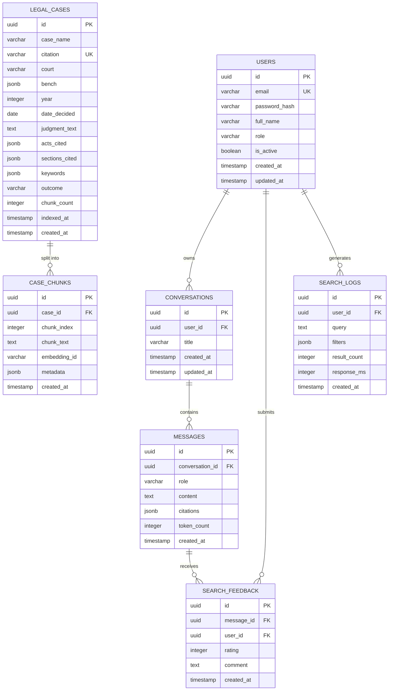

# ChronoLegal — Entity Relationship Diagram

## Mermaid ER Diagram



---

## Table Descriptions

### `users`
Application users. `role` is either `user` or `admin`. Passwords stored as bcrypt hash (12 rounds).

### `conversations`
A named chat session belonging to a user. `title` is auto-generated from the first question (first 60 chars).

### `messages`
Individual turns in a conversation. `role` is `user` or `assistant`. `citations` is a JSONB array of `{case_name, citation, court, year, relevance_score, chunk_text}` objects attached to assistant messages.

### `legal_cases`
One row per Indian judgment. `bench`, `acts_cited`, `sections_cited`, and `keywords` use JSONB arrays. `citation` is unique (e.g. `(1973) 4 SCC 225`). GIN index on `acts_cited` enables containment queries.

### `case_chunks`
Each judgment is split into ~300-token overlapping chunks. `embedding_id` is the ChromaDB document ID, enabling bidirectional lookup between the relational store and the vector store.

### `search_feedback`
User thumbs-up/thumbs-down + optional comment on an assistant message. `rating` is 1–5.

### `search_logs`
Every search and chat query is logged for analytics and monitoring.

---

## Relationships Summary

| Relationship | Cardinality | Notes |
|-------------|------------|-------|
| user → conversations | 1:N | A user owns many conversations |
| conversation → messages | 1:N | Ordered by `created_at` |
| message → search_feedback | 1:1 | One feedback per message max |
| user → search_logs | 1:N | Every query logged |
| legal_case → case_chunks | 1:N | Chunks are the unit of embedding |

---

## ChromaDB (Vector Store)

Not a relational table — documents stored in ChromaDB with metadata:

```json
{
  "id": "<embedding_id>",
  "document": "<chunk_text>",
  "metadata": {
    "case_id": "<uuid>",
    "case_name": "Kesavananda Bharati v. State of Kerala",
    "citation": "(1973) 4 SCC 225",
    "court": "Supreme Court of India",
    "year": 1973,
    "chunk_index": 3,
    "acts_cited": ["Constitution of India"],
    "outcome": "Dismissed"
  }
}
```

Linked back to PostgreSQL via `case_id`.
