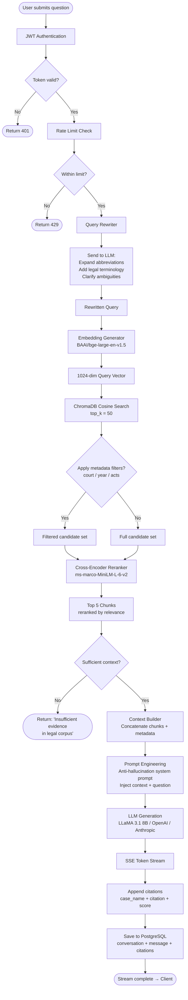
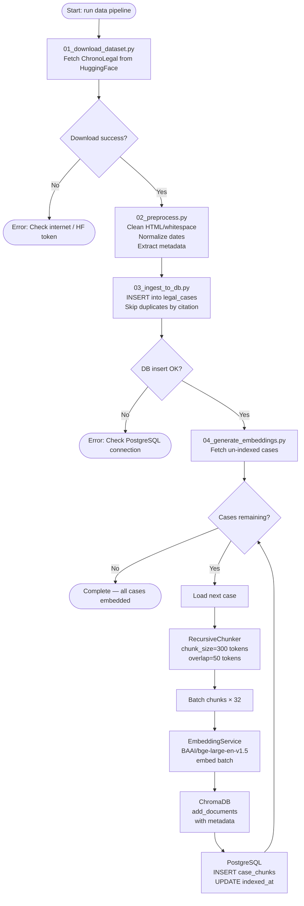
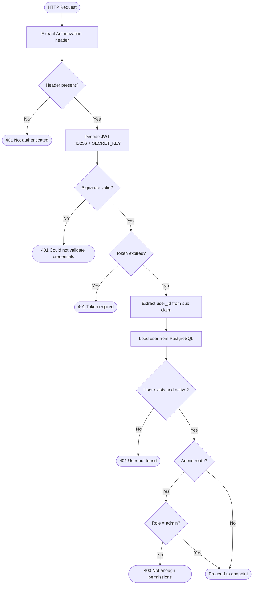
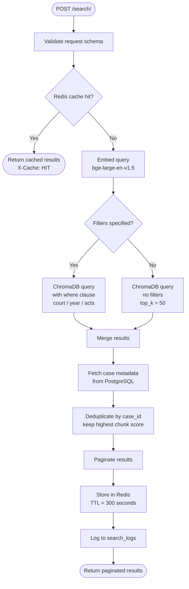
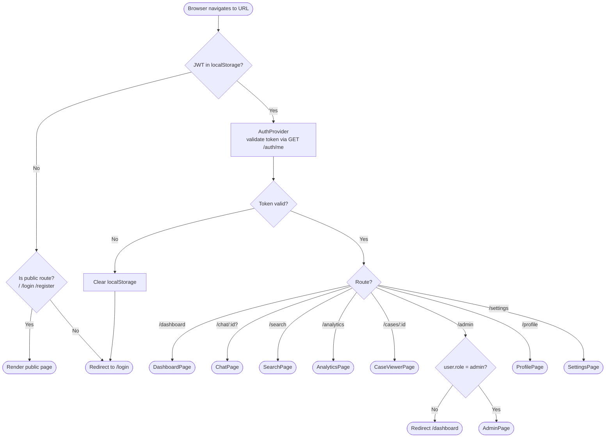

# ChronoLegal — Flowcharts

---

## 1. RAG Pipeline — Detailed Flowchart

---

## 2. Data Ingestion Pipeline

---

## 3. Authentication Flow

---

## 4. Search Decision Flow

---

## 5. Frontend Routing Flow

