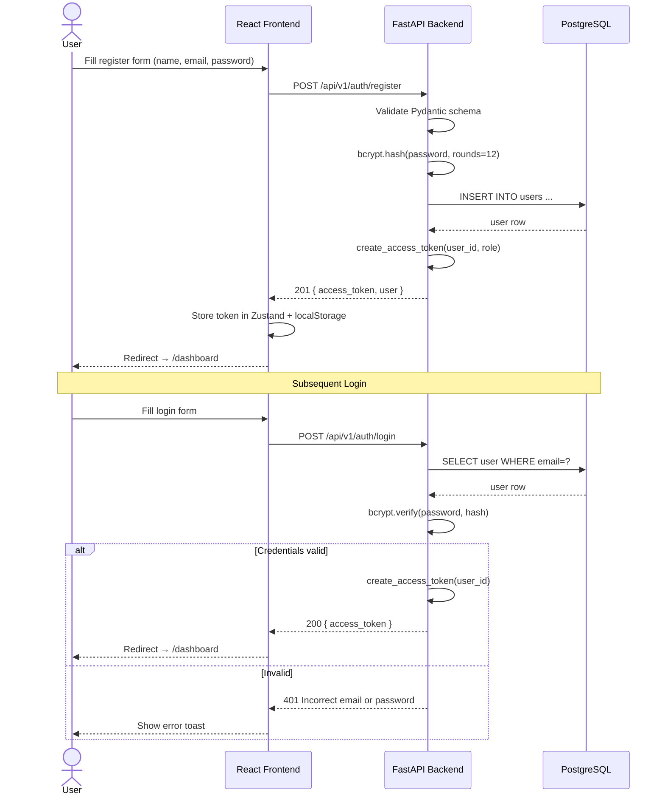
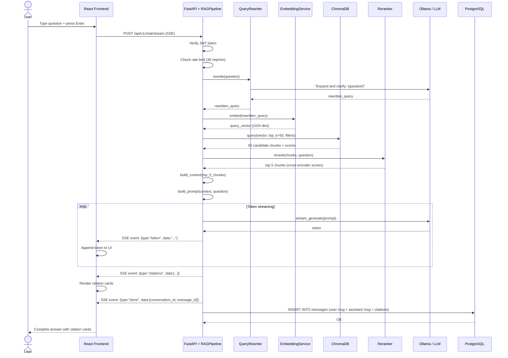
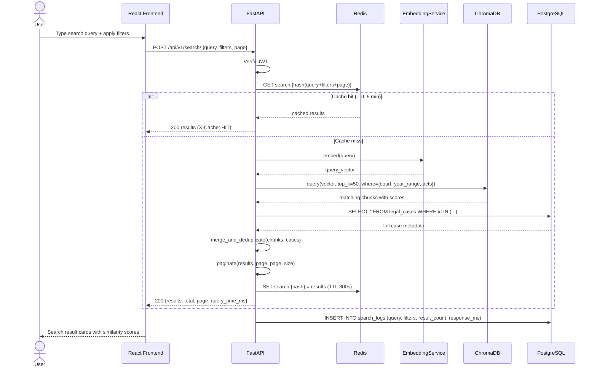
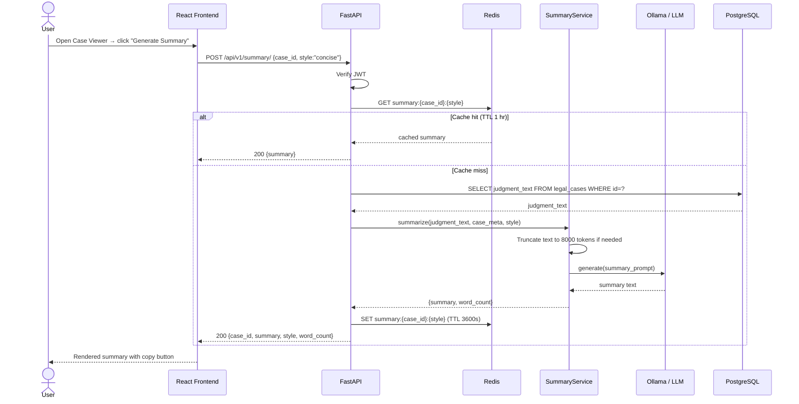
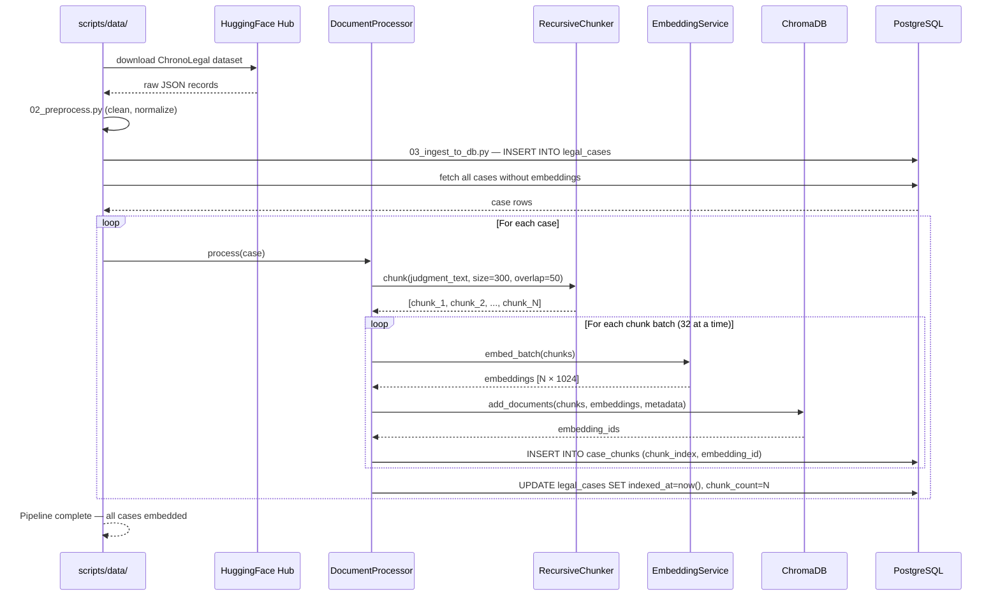
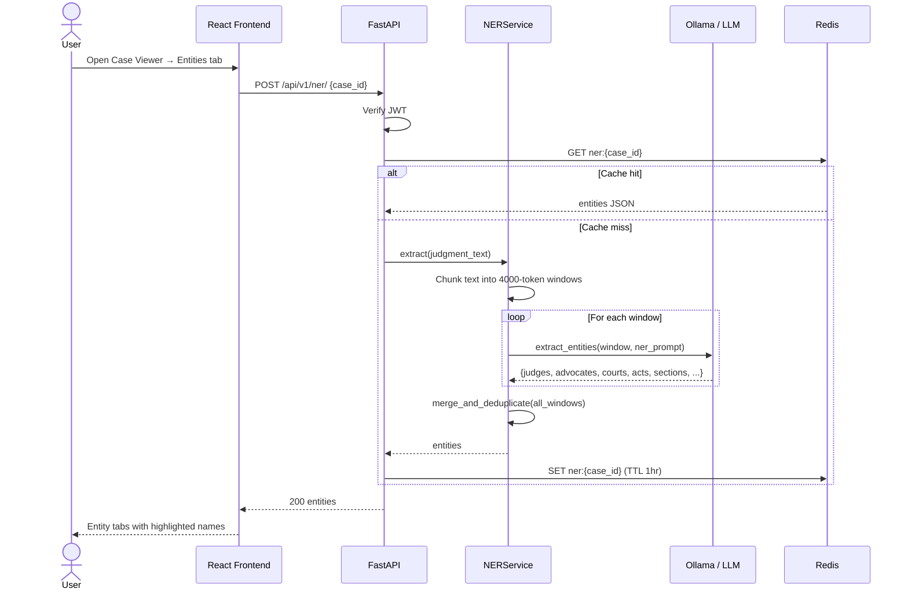

# ChronoLegal — Sequence Diagrams

---

## 1. User Registration & Login

---

## 2. RAG Chat — Streaming Q&A

---

## 3. Semantic Search

---

## 4. Case Summary Generation

---

## 5. Document Ingestion Pipeline

---

## 6. NER Extraction

